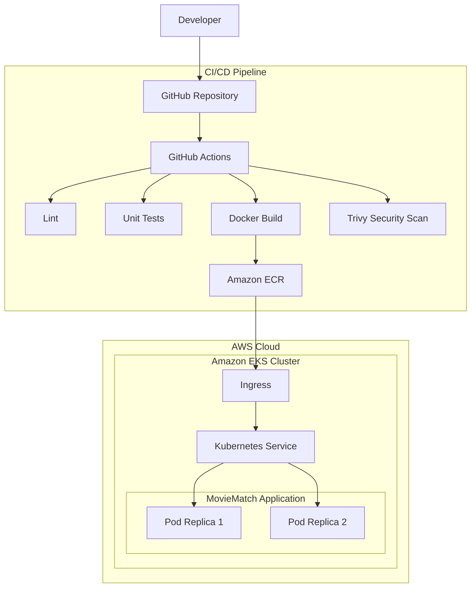
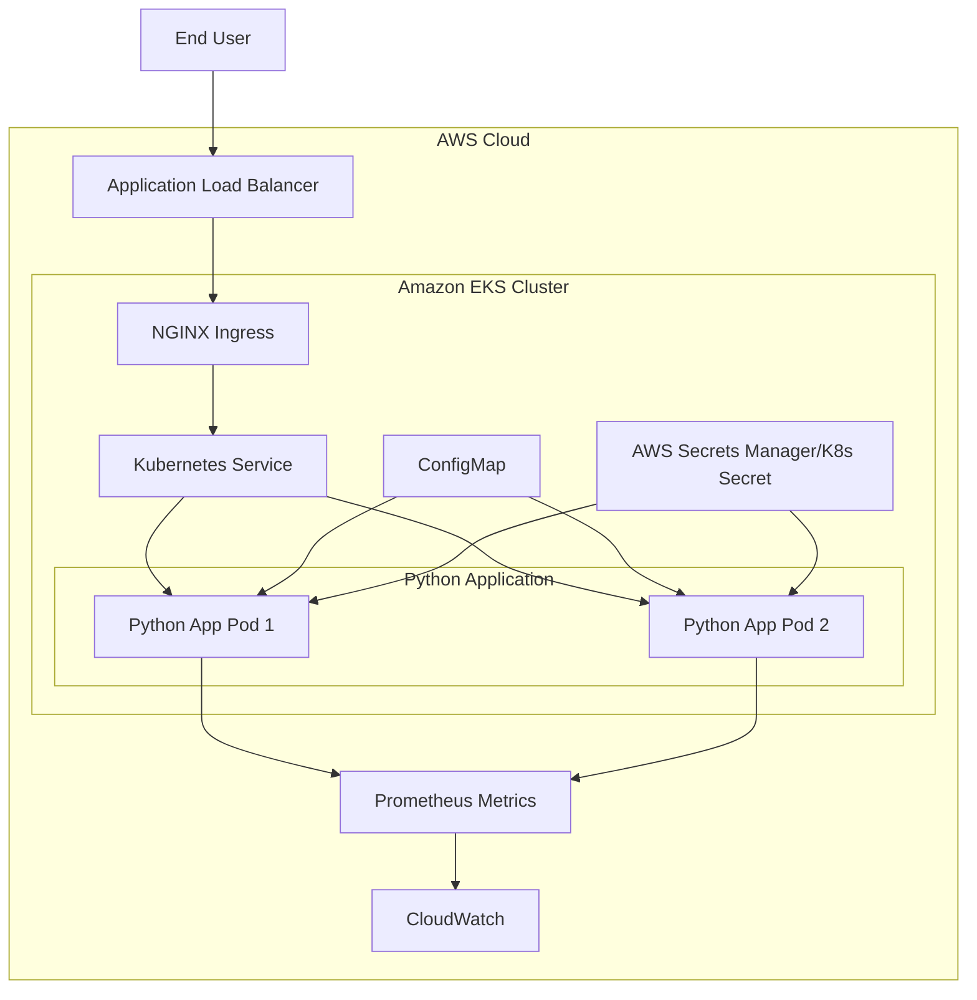

# Micro1 DevOps Engineer Take-Home Assessment

## Overview

This repository contains a production-style backend platform demonstrating modern DevOps practices across application development, infrastructure automation, Kubernetes orchestration, CI/CD, security, and observability.

The solution consists of:

* FastAPI backend service
* Docker containerization
* Kubernetes deployment manifests
* AWS infrastructure provisioned using Terraform
* GitHub Actions CI/CD pipeline
* Security scanning with Trivy
* Structured JSON logging
* Prometheus-compatible metrics

The primary objective of this implementation is to demonstrate infrastructure automation, deployment reliability, security controls, and operational readiness rather than complex application business logic.

---

# Architecture



## Infrastructure Provisioned via Terraform

```text
AWS
│
├── VPC
│   ├── Public Subnets
│   ├── Private Subnets
│   └── NAT Gateway
│
├── Amazon ECR
│
├── Amazon EKS
│   └── Managed Node Group
│
└── IAM
    └── GitHub OIDC Deployment Role
```

# AWS Infra



---

# Technology Stack

| Component              | Technology              |
| ---------------------- | ----------------------- |
| Backend                | FastAPI                 |
| Language               | Python 3.12             |
| Containerization       | Docker                  |
| Orchestration          | Kubernetes              |
| Infrastructure as Code | Terraform               |
| Cloud Platform         | AWS                     |
| CI/CD                  | GitHub Actions          |
| Image Registry         | Amazon ECR              |
| Kubernetes Platform    | Amazon EKS              |
| Security Scanning      | Trivy                   |
| Metrics                | Prometheus              |
| Logging                | Structured JSON Logging |

---

# Repository Structure

```text
.
├── app/
│   ├── main.py
│   └── logging_config.py
│
├── tests/
│   └── test_health.py
│
├── k8s/
│   ├── deployment.yaml
│   ├── service.yaml
│   ├── ingress.yaml
│   ├── configmap.yaml
│   └── secret.yaml
│
├── terraform/
│   ├── providers.tf
│   ├── variables.tf
│   ├── vpc.tf
│   ├── ecr.tf
│   ├── eks.tf
│   ├── iam.tf
│   └── outputs.tf
│
├── docs/
│   └── AI_USAGE.md
│
├── .github/
│   └── workflows/
│       └── ci-cd.yml
│
├── architecture.png
├── Dockerfile
├── requirements.txt
└── README.md
```

---

# Application Endpoints

| Endpoint       | Purpose             |
| -------------- | ------------------- |
| `/`            | Root endpoint       |
| `/health`      | Liveness probe      |
| `/ready`       | Readiness probe     |
| `/api/v1/info` | Service information |
| `/metrics`     | Prometheus metrics  |

---

# Local Development

## Prerequisites

* Python 3.12+
* Docker
* Kubernetes (Docker Desktop, Kind, or Minikube)
* Terraform 1.6+
* AWS CLI (optional)

---

## Clone Repository

```bash
git clone git@github.com:Gowtham0991/micro1-devops.git

cd micro1-devops
```

---

## Create Virtual Environment

```bash
python3 -m venv venv

source venv/bin/activate
```

---

## Install Dependencies

```bash
pip install -r requirements.txt
```

---

## Run Application

```bash
uvicorn app.main:app --reload
```

Application:

```text
http://localhost:8000
```

Swagger Documentation:

```text
http://localhost:8000/docs
```

---

## Run Tests

```bash
pytest
```

---

## Run Linting

```bash
flake8 app
```

---

# Docker

## Build Image

```bash
docker build -t micro1-devops:1.0 .
```

## Run Container

```bash
docker run -p 8000:8000 micro1-devops:1.0
```

Verify:

```bash
curl http://localhost:8000/health
```

---

# Kubernetes Deployment

## Deploy Resources

```bash
kubectl apply -f k8s/configmap.yaml

kubectl apply -f k8s/secret.yaml

kubectl apply -f k8s/deployment.yaml

kubectl apply -f k8s/service.yaml

kubectl apply -f k8s/ingress.yaml
```

---

## Verify Resources

```bash
kubectl get pods

kubectl get svc

kubectl get ingress
```

---

## Port Forward Service

```bash
kubectl port-forward svc/micro1-service 8080:80
```

Verify:

```bash
curl http://localhost:8080/health
```

---

# Terraform

Terraform provisions AWS infrastructure required to support the Kubernetes platform.

## Provisioned Resources

### Networking

* VPC
* Public Subnets
* Private Subnets
* Route Tables
* NAT Gateway

### Container Platform

* Amazon EKS Cluster
* EKS Managed Node Group

### Container Registry

* Amazon ECR Repository
* ECR Image Scanning

### Identity & Access Management

* GitHub OIDC Provider
* GitHub Actions IAM Role
* ECR Push Permissions
* EKS Access Permissions

---

## Terraform Commands

### Initialize

```bash
cd terraform

terraform init
```

### Format

```bash
terraform fmt -recursive
```

### Validate

```bash
terraform validate
```

### Plan

```bash
terraform plan
```

### Apply

```bash
terraform apply
```

Note:

Provisioning requires valid AWS credentials and may incur AWS charges.

---

# CI/CD Pipeline

The GitHub Actions workflow implements both Continuous Integration and Continuous Deployment stages.

## Continuous Integration

Every push or pull request triggers:

1. Linting
2. Unit Testing
3. Docker Image Build
4. Trivy Vulnerability Scan

## Continuous Deployment

The deployment stages are implemented but intentionally disabled.

Once AWS infrastructure is provisioned and GitHub OIDC is configured, the workflow can:

1. Authenticate to AWS
2. Push images to Amazon ECR
3. Deploy to Amazon EKS
4. Verify rollout status

This design allows infrastructure and deployment automation to remain fully reproducible while avoiding unnecessary cloud costs during evaluation.

---

# Security Controls

The implementation includes multiple security layers.

## Container Security

* Non-root container execution
* Privilege escalation disabled
* Minimal base image

## Kubernetes Security

* Secrets separated from configuration
* Security context enforcement
* Resource requests and limits
* Health probes

## Supply Chain Security

* Trivy vulnerability scanning
* ECR image scanning

## Identity Management

* GitHub OIDC authentication
* No long-lived AWS credentials
* Least privilege IAM permissions

## Network Security

* Private EKS worker nodes
* Network segmentation through VPC and private subnets

---

# Observability

## Structured Logging

Application logs are emitted in structured JSON format.

Example:

```json
{
  "levelname": "INFO",
  "message": "Health check requested"
}
```

Benefits:

* Easier searching
* Machine-readable parsing
* Better integration with centralized logging platforms

---

## Metrics

Prometheus-compatible metrics are exposed through:

```text
/metrics
```

Metrics include:

* Request count
* Request duration
* Error rates
* HTTP status codes

---

# Design Decisions

## Why FastAPI?

FastAPI provides:

* Lightweight API framework
* Automatic OpenAPI documentation
* Strong developer experience
* Production readiness

---

## Why EKS?

EKS provides a managed Kubernetes control plane and reduces operational overhead while preserving Kubernetes flexibility.

---

## Why GitHub OIDC?

OIDC removes the need for long-lived AWS access keys and follows AWS security best practices.

---

## Why Managed Node Groups?

Managed node groups reduce administrative overhead and allow AWS to manage node lifecycle operations.

---

# Tradeoffs

Several tradeoffs were intentionally made to keep the assessment focused and cost-effective.

* AWS infrastructure is defined but not fully provisioned.
* Deployment stages are implemented but disabled.
* A single NAT Gateway is used for simplicity.
* Monitoring focuses on metrics exposure rather than a full Prometheus/Grafana stack.

---

# Future Improvements

Potential enhancements include:

* ArgoCD GitOps deployment
* Horizontal Pod Autoscaler (HPA)
* Prometheus and Grafana
* OpenTelemetry tracing
* External Secrets Operator
* AWS Load Balancer Controller
* ECR image signing
* Kubernetes Network Policies
* AWS WAF integration

---
## Important Notes

### AWS Infrastructure Not Provisioned

Terraform resources are defined but were not deployed as part of the assessment.

### Deployment Pipeline Disabled

ECR image publishing and EKS deployment stages are implemented but intentionally disabled until AWS infrastructure is provisioned.

### Ingress Controller Required

An ingress controller (AWS Load Balancer Controller or NGINX Ingress Controller) is required for Kubernetes Ingress resources to function.

### Secret Management

Kubernetes Secrets are included for demonstration purposes. Production environments should use a dedicated secret management solution.

### Terraform State Management

Terraform currently uses local state. A remote backend is recommended for production use.

### Cost Considerations

Provisioning the AWS infrastructure defined in Terraform will incur AWS charges. 

---

# AI Usage

AI assistance was used during the implementation process to accelerate scaffolding, documentation, and infrastructure design.

A detailed breakdown of:

* Prompts used
* Why those prompts were chosen
* Where AI-generated suggestions were modified

is available in:

```text
docs/AI_USAGE.md
```

All architecture decisions, implementation validation, testing, troubleshooting, and final design choices were reviewed and performed manually.

END

---
